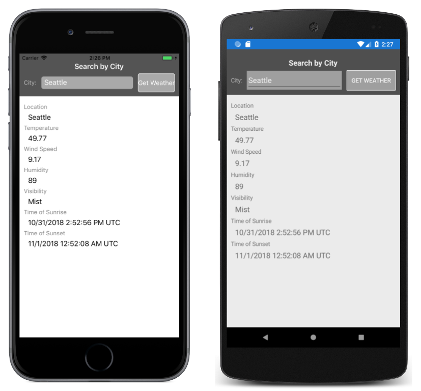

# Weather App New Relic Insights Example

This application contains examples of sending data to New Relic using Post requests to the Insights API. The app is based on the WeatherApp which a sample app that retrieves weather data from OpenWeatherMap.

To use this sample, you must sign up for a free API key at [https://openweathermap.org/appid](https://openweathermap.org/appid). Paste that key into the `Constants.OpenWeatherMapAPIKey` property.
You will also a New Relic Insights Key along with an account URL:
https://docs.newrelic.com/docs/apis/get-started/intro-apis/types-new-relic-api-keys#event-insert-key 

1. Navigate to the `Constants.cs` file.
2. Replace `OpenWeatherMapAPIKey` value with the free API key generated for the open weather map api.
3. Replace `InsightsUrl` value with url for the Insights api, it will have the format of `https://insights-collector.newrelic.com/v1/accounts/<YOUR_ACCOUNT_ID>/events`
4. Replace `InsightsKey` value with your Insights Insert Key.
5. Build and Run.

